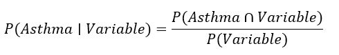

For Asthma Prevalence

According to the data collect in 2017, about 13% of respondents reported currently or formerly having asthma, and about 86% reported never having asthma. Since the proportion of respondents with asthma was relatively small, it's likely that the distribution and characteristics would be affected by those of the whole data set population. Therefore, it would be more informative to look at the data in terms of **proportion** and **conditional probability**, that is, finding the probability of a user having asthma given he/she belongs to a "level" of a variable group.

For Asthma Risk

Logistic Regression is used to model the relationship between the probability of the response variable given a change in the value of a predictor. To classify users into "Have Asthma" and "Does Not Have Asthma" categories, Binary Logistic Regression was chosen. Logistic regression was performed in R, using the glm() function in package {stat}, with "family=binomial(link="logit")". 

Binary Logistic Regression Model was run on the train subset, using all demographic and health risk factors: *"AgeGroup", "Sex", "Race", "Income Group", "EducationLevel", "CurrentSmoker", "Exercise", "BMICategory", and "DepressiveDisorders"* as predictors, predicting the log-odd of the response variable "AsthmaStatus".All predictors were categorical variables, presented as factors with levels in the logistic regression model. The response variable "AsthmaStatus" was a binary variable, with 1 representing the "Current" status, or respondents *"currently"* having asthma at the time of the survey, and 0 representing both *"Former"* and *"Never"* statuses, or respondents "not currently" having asthma at the time of the survey. 

The data was partitioned into a training set - a sample of 60% of observations, and a test set - the rest of the data. The model built from the train subset was then tested by fitting to the test subset and calculating the predictive accuracy and specificity/sensitivity trade-off using a graph called the Receiver Operating Characteristics Curve. 

At 16% threshold, the model predicted with 84% accuracy rate, 16% error rate, 29% True-Positive (Sensitivity) Rate, and 90% True-Negative (Specificity) Rate. Thus, 30% of the times, if a respondent had a calculated asthma probability of more than 16%, the model predicted accurately that he/she would have asthma; 90% of the times, if a respondent had a calculated asthma probability of 16% or below, the model predicted accurately that he/she would not have asthma.